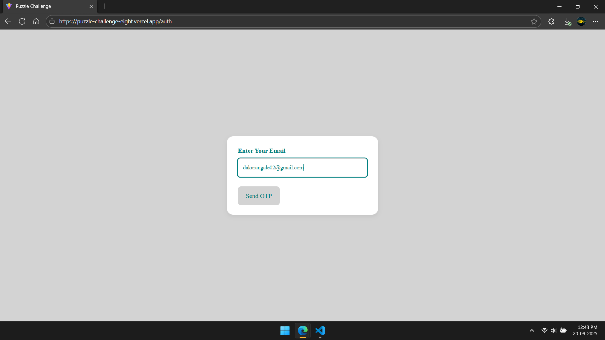
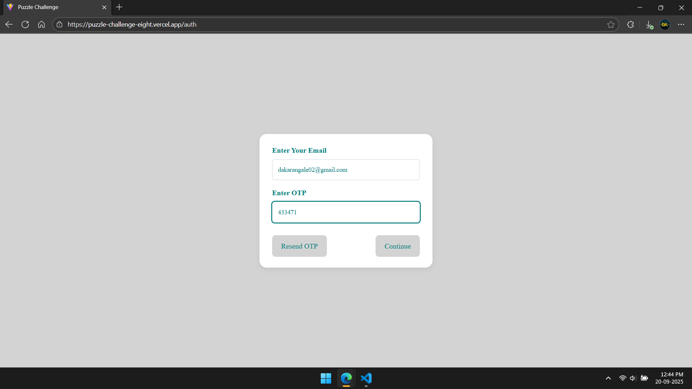
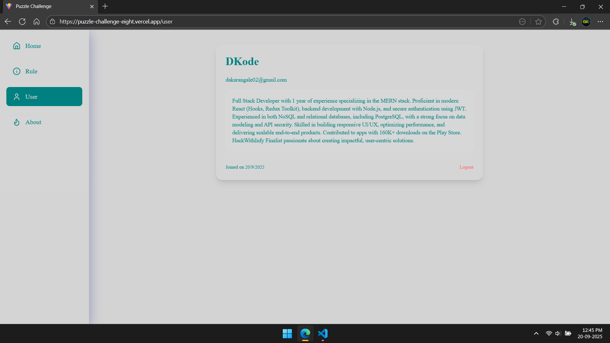
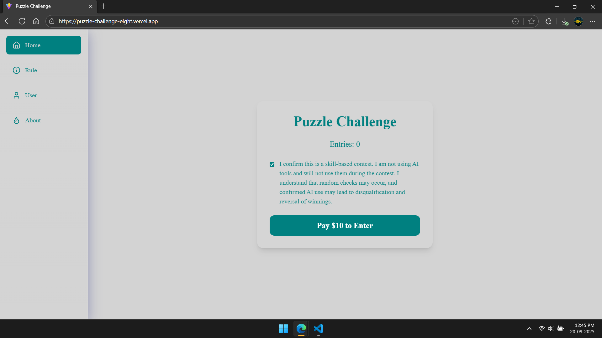
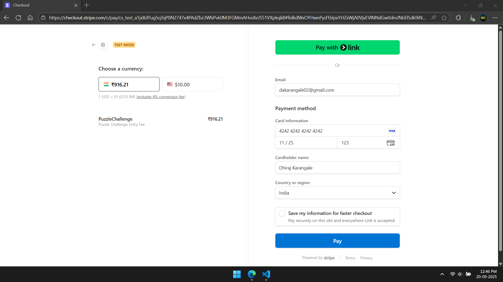
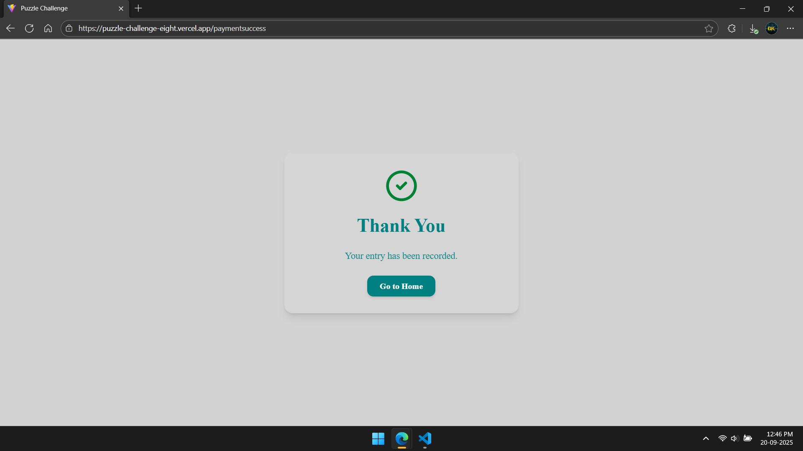
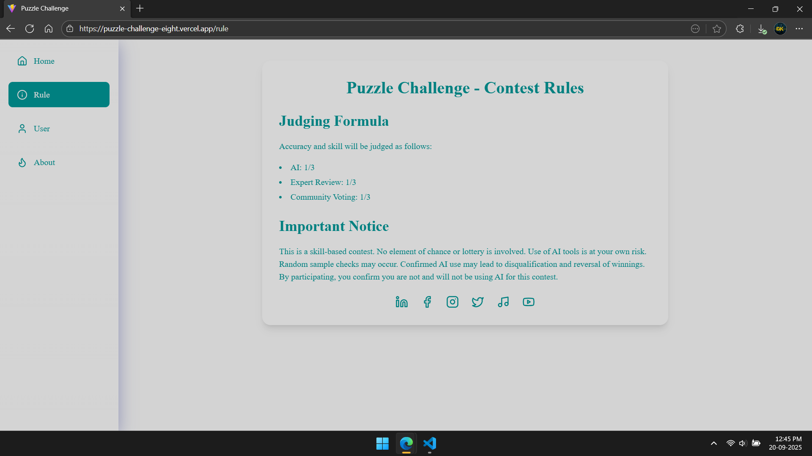
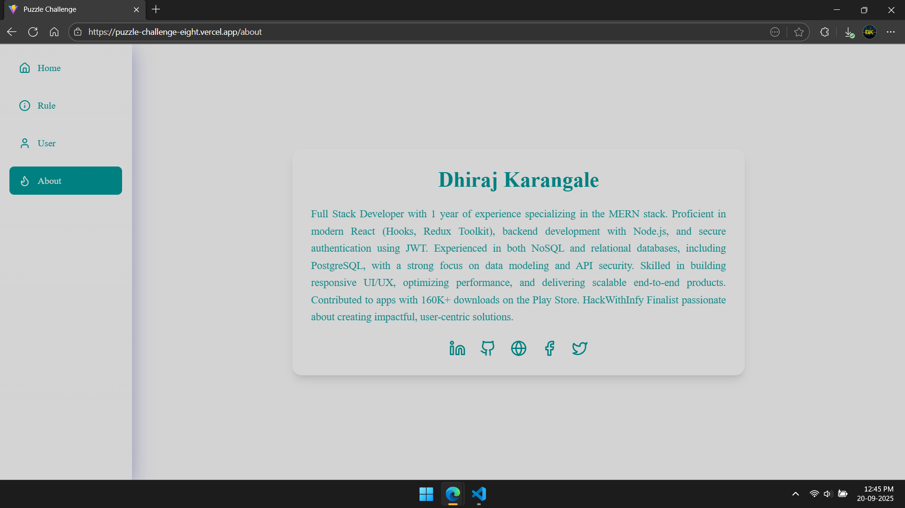
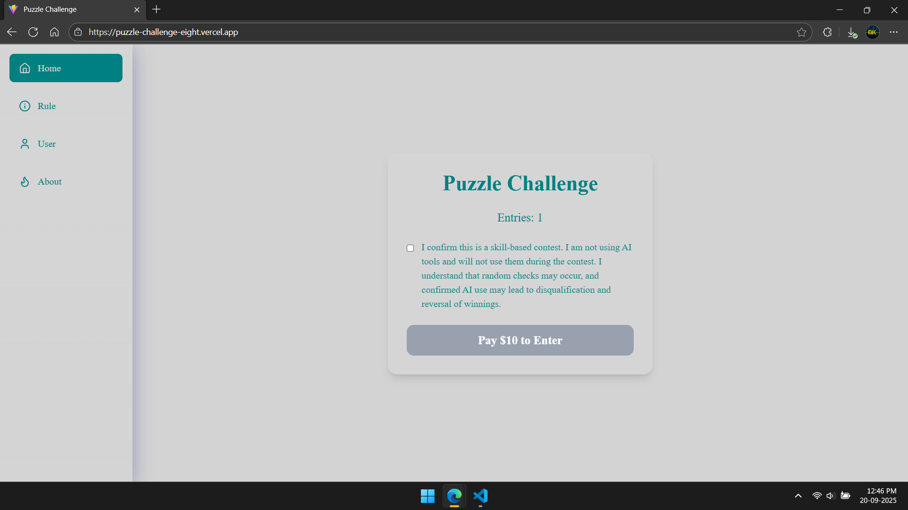

# 🧩 Puzzle Challenge

A **MERN Stack Project** featuring **OTP-based authentication**, **Stripe payment integration**, and a **responsive UI** optimized for desktop and mobile.

🚀 **Live Demo (Frontend):** [Puzzle Challenge](https://puzzle-challenge-eight.vercel.app/)
📂 **Repository:** [GitHub Repo](https://github.com/DhirajKarangale/PuzzleChallenge)

---

## ✨ Features

* 🔐 **Authentication with OTP**

  * User enters email → receives OTP → logs in securely.

* 💳 **Stripe Payment Integration**

  * User must confirm via checkbox → click **Pay** → redirected to Stripe checkout.
  * Supports **Stripe Test Card:**

    ```
    4242 4242 4242 4242
    Exp: Any future date
    CVC: Any 3 digits
    ZIP: Any 5 digits
    ```

* 📱 **Responsive UI**

  * Mobile-first design using **Tailwind CSS**.
  * Smooth animations powered by **Framer Motion**.

* ⚡ **Modern Tech Stack**

  * Frontend: React 19, Redux Toolkit, TailwindCSS, React Router DOM.
  * Backend: Express.js, PostgreSQL, Stripe API, JWT for auth, Nodemailer for OTPs.

---

## 🏗️ Project Structure

```
puzzle-challenge/
├── frontend/     # React + Tailwind + Redux Toolkit
└── backend/      # Express + PostgreSQL + Stripe + Nodemailer
```

---

## 📦 Tech Stack

### Frontend

* ⚛️ React 19
* 🎨 TailwindCSS + Tailwind Animate
* 🔄 Redux Toolkit & React Redux
* 🎬 Framer Motion
* 🌐 React Router DOM
* 📡 Axios

### Backend

* 🚀 Express.js (v5)
* 🐘 PostgreSQL (pg)
* 🔑 JWT (JSON Web Tokens)
* 📧 Nodemailer (OTP service)
* 💳 Stripe API
* 🌍 CORS, Body-Parser

---

## 📸 Screenshots

### Authentication Flow

| Email Input                                             | OTP Verification                                    | User Profile                                 |
| ------------------------------------------------------- | --------------------------------------------------- | -------------------------------------------- |
|  |  |  |

### Payment Flow

| Pay Page                                   | Stripe Checkout                                         | Success                                                           |
| ------------------------------------------ | ------------------------------------------------------- | ----------------------------------------------------------------- |
|  |  |  |

### Other Screens

| Home                                         | Rule                                         | About                                          | After Payment                                                 |
| -------------------------------------------- | -------------------------------------------- | ---------------------------------------------- | ------------------------------------------------------------- |
|  |  |  |  |

---

## ⚙️ Setup Instructions

### Frontend

```bash
cd frontend
npm install
npm run dev
```

**Environment Variables (.env)**

```env
VITE_URL_BASE=https://puzzlechallenge.onrender.com
```

Frontend runs on: **[http://localhost:5173](http://localhost:5173)**

---

### Backend

```bash
cd backend
npm install
npm run dev
```

**Environment Variables (.env)**

```env
PORT=1000

FRONTEND=https://puzzle-challenge-eight.vercel.app/

JWT_SECRET=your_jwt_secret_here

EMAIL=your_email@example.com
EMAILPASS=your_email_app_password

DB_HOST=your_database_host
DB_NAME=your_database_name
DB_PASSWORD=your_database_password
DB_USER=your_database_user
DB_PORT=5432

STRIPE_SECRET_KEY=your_stripe_secret_key
STRIPE_WEBHOOK_SECRET=your_stripe_webhook_secret
```

Backend runs on: **[http://localhost:1000](http://localhost:1000)**

> ⚠️ Replace all dummy values with your real credentials before running.

---

## 📂 API Overview

* `POST /auth/send-otp` → Sends OTP to user email
* `POST /auth/verify-otp` → Verifies OTP and generates JWT
* `POST /payment/create-checkout` → Creates Stripe checkout session
* `POST /webhook` → Handles Stripe payment events

---

## 🧪 Stripe Testing

Use the following **test card**:

```
4242 4242 4242 4242
Exp: Any future date
CVC: Any 3 digits
ZIP: Any 5 digits
```

---

## 🤝 Contributing

1. Fork the repo
2. Create a feature branch (`git checkout -b feature-name`)
3. Commit your changes (`git commit -m "Add feature"`)
4. Push to the branch (`git push origin feature-name`)
5. Open a Pull Request

---

## Handover Instructions

### Loading Puzzles
Puzzles can be loaded into the `puzzles` table with fields:
- `question`  
- `options`  
- `correct_answer`  
- `points`

### Contest Entries
Users are stored in the `users` table (`email`, `entriesCount`).  
After a successful Stripe payment, `entriesCount` is incremented dynamically using the backend API.

### Stripe Success / Cancel URLs
- **Success URL:** `/paymentsuccess`  
- **Cancel URL:** `/paymentfail`
